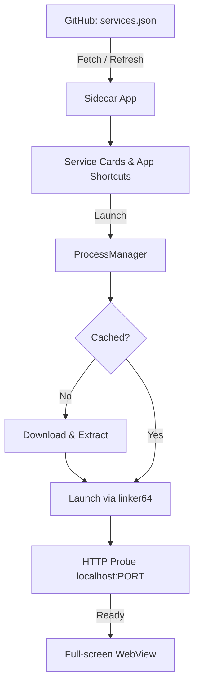

# Sidecar

A configuration-driven Android companion runner to host background binaries and access their web interfaces in full-screen WebViews.

[](https://github.com/aar0u/sidecar/actions/workflows/release.yml)

## Architecture



## Configuration (`services.json`)

Define services in a remote JSON file (e.g. hosted on GitHub). No Android app updates needed when adding new services.

```json
[
  {
    "id": "oktv",
    "name": "OKTV",
    "description": "电视 / 流媒体播放器",
    "downloadUrl": "https://github.com/aar0u/deploy/releases/download/latest/tv-android.tar.gz",
    "binaryName": "tv",
    "args": ["web"],
    "port": 8080,
    "url": "http://localhost:8080",
    "keepScreenOn": true
  }
]
```

| Field | Type | Description |
| :--- | :--- | :--- |
| `id` | `string` | Unique identifier (used for isolated storage directory). |
| `name` | `string` | Display name for cards and home screen shortcuts. |
| `description`| `string` | Short description. |
| `downloadUrl`| `string` | URL to `.tar.gz` archive or binary. |
| `binaryName` | `string` | Executable filename after extraction. |
| `args` | `array` | Arguments passed to the executable. |
| `port` | `integer`| Port for HTTP health probing. |
| `url` | `string` | Web interface URL loaded into the WebView. |
| `keepScreenOn`| `boolean`| Keeps the display on while viewing this service. |

## Notes

* **Binary Execution**: Downloaded binaries are executed via `/system/bin/linker64` inside the app's private files directory. If an embedded binary (`lib<id>.so`) is packaged in `jniLibs/arm64-v8a/`, it is executed directly from `nativeLibraryDir`.
* **App Shortcuts**: Services appear in the home screen long-press popup menu for one-tap direct access.
* **Offline Support**: The remote configuration is cached locally; previously downloaded services run without an internet connection.

## Build

```bash
cd android && ./gradlew assembleRelease
```